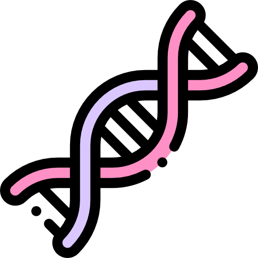

#  Trabajo Global UTN Python

## Integrantes

- Torres Matias Santiago
- Canciani Gianfranco
- Leiva Julio
- Pereyra Juan

Trabajo integrador para la tecnicatura superior en programacion UTN-FRM

Este programa permite ingresar matrices de ADN y realizar diferentes operaciones sobre ellas, como detectar mutantes, crear mutantes y sanar mutantes.

## Requisitos Previos

- Python 3.x instalado en el sistema.
- Archivos necesarios en el mismo directorio:
  - `ejecutable.py`
  - `clases.py`
  - `funciones.py`
  - `objetos.py` (debe contener los diccionarios `matrices`, `objetos_detector`, `objetos_radiacion`, `objetos_virus` y `objetos_sanador`)

## Cómo Ejecutar el Programa

1. Abra una terminal en el directorio donde se encuentran los archivos.
2. Ejecute el siguiente comando:

```
python ejecutable.py
```

## Funcionalidades del Programa
1. Ingresar ADN
Permite al usuario ingresar una matriz de ADN de 6x6. El ADN debe ser ingresado como una cadena de caracteres separada por comas, por ejemplo:

```
AGATCA, GATTCA, CAACAT, GAGCTA, ATTGCG, CTGTTC
```

El ADN ingresado se almacena en el diccionario `matrices` en objetos.py.

2. Detectar Mutantes
Permite detectar mutantes en una matriz de ADN previamente ingresada. El usuario debe ingresar el nombre del ADN que desea analizar. El resultado de la detección se imprime en pantalla, mostrando la cantidad de mutantes horizontales, verticales y diagonales.

3. Crear Mutante
Permite crear mutantes en una matriz de ADN previamente ingresada. El usuario debe ingresar el nombre del ADN, la base nitrogenada a mutar (A, C, G, T), la orientación de la mutación (horizontal, vertical, diagonal) y la posición inicial de la mutación (fila y columna). El ADN mutado se almacena en el diccionario `matrices` en objetos.py.

4. Sanar Mutantes
Permite sanar mutantes en una matriz de ADN previamente ingresada. El usuario debe ingresar el nombre del ADN que desea sanar. El ADN sanado se almacena en el diccionario `objetos_detector` en objetos.py.

5. Imprimir ADN
Permite imprimir una matriz de ADN previamente ingresada. El usuario debe ingresar el nombre del ADN que desea imprimir. El ADN se imprime en pantalla.

6. Salir
Permite salir del programa.

Estructura del Código
ejecutable.py
Contiene la función `main` que presenta un menú al usuario y llama a las funciones correspondientes según la opción seleccionada.

clases.py
Contiene las clases `Detector`, `Mutador`, `Radiacion`, `Virus` y `Sanador` que implementan la lógica para detectar, crear y sanar mutantes en el ADN.

funciones.py
Contiene las funciones `ingresar_ADN`, `verificar_ADN`, `imprimir_ADN`, `funcion_detectar`, `funcion_mutacion`, `funcion_sanador` y `funcion_imprimir_ADN` que implementan las funcionalidades del programa.

objetos.py
Contiene los diccionarios `matrices`, `objetos_detector`, `objetos_radiacion`, `objetos_virus` y `objetos_sanador` que almacenan las matrices de ADN y los objetos creados durante la ejecución del programa.

## Ejemplo de Uso del Programa
A continuación, se muestra un ejemplo de cómo utilizar el programa para ingresar un ADN, detectar mutantes, crear un mutante, sanar mutantes e imprimir el ADN.

Paso 1: Ingresar ADN
Ejecute el programa y seleccione la opción `1` para ingresar un ADN.
```
1. Ingresar ADN
2. Detectar mutantes
3. Crear mutante
4. Sanar mutantes
5. Imprimir ADN
6. Salir

Ingrese una opcion: 1
```
Ingrese el ADN en el formato especificado:
```
Ingrese un ADN de 6x6, separando cada fila por "," ejemplo:
AGATCA, GATTCA, CAACAT, GAGCTA, ATTGCG, CTGTTC

Ingrese el ADN: AGATCA, GATTCA, CAACAT, GAGCTA, ATTGCG, CTGTTC
Ingrese el nombre para su ADN: mutante1
```
El ADN ingresado se imprimirá en pantalla:
```
Su ADN: 
        [    A    G    A    T    C    A    ]
        [    G    A    T    T    C    A    ]
        [    C    A    A    C    A    T    ]
        [    G    A    G    C    T    A    ]
        [    A    T    T    G    C    G    ]
        [    C    T    G    T    T    C    ]
```
Paso 2: Detectar Mutantes
Seleccione la opción `2` para detectar mutantes en el ADN ingresado.
```
1. Ingresar ADN
2. Detectar mutantes
3. Crear mutante
4. Sanar mutantes
5. Imprimir ADN
6. Salir

Ingrese una opcion: 2
Ingrese el nombre del ADN: mutante1
```
El programa detectará y mostrará si hay mutantes en el ADN:
```
False
```
Paso 3: Crear Mutante
Seleccione la opción `3` para crear un mutante en el ADN ingresado.
```
1. Ingresar ADN
2. Detectar mutantes
3. Crear mutante
4. Sanar mutantes
5. Imprimir ADN
6. Salir

Ingrese una opcion: 3
Ingrese el nombre del ADN: mutante1
```
Ingrese la base nitrogenada, la orientación de la mutación y la posición inicial:
```
Ingrese la base nitrogenada a mutar
(A) Adenina (C) Citosina (G) Guanina (T) Timina
A

Ingrese la orientacion de la mutacion
Horizontal, Vertical, Diagonal
horizontal

Ingrese la fila de la mutacion: 1
Ingrese la columna de la mutacion: 1
```
El ADN mutado se imprimirá en pantalla:
```
Mutante creado
Su ADN: 
        [    A    A    A    A    C    A    ]
        [    G    A    T    T    C    A    ]
        [    C    A    A    C    A    T    ]
        [    G    A    G    C    T    A    ]
        [    A    T    T    G    C    G    ]
        [    C    T    G    T    T    C    ]
```
Paso 4: Sanar Mutantes
Seleccione la opción `4` para sanar mutantes en el ADN ingresado.
```
1. Ingresar ADN
2. Detectar mutantes
3. Crear mutante
4. Sanar mutantes
5. Imprimir ADN
6. Salir

Ingrese una opcion: 4
Ingrese el nombre del ADN: mutante1
```
El ADN sanado se imprimirá en pantalla:
```
Mutante sanado
Su ADN: 
        [    T    G    C    T    G    C    ]
        [    A    T    G    C    T    G    ]
        [    C    G    A    T    G    C    ]
        [    T    G    C    T    G    C    ]
        [    A    T    G    C    T    G    ]
        [    C    G    A    T    G    C    ]
```
Paso 5: Imprimir ADN
Seleccione la opción `5` para imprimir el ADN ingresado.
```
1. Ingresar ADN
2. Detectar mutantes
3. Crear mutante
4. Sanar mutantes
5. Imprimir ADN
6. Salir

Ingrese una opcion: 5
Ingrese el nombre del ADN: mutante1
```
El ADN se imprimirá en pantalla:
```
                Mutantes horizontales: 0
                Mutantes verticales: 0
                Mutantes diagonales: 0
```